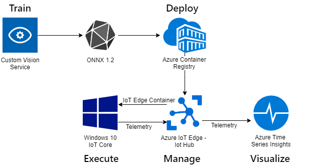
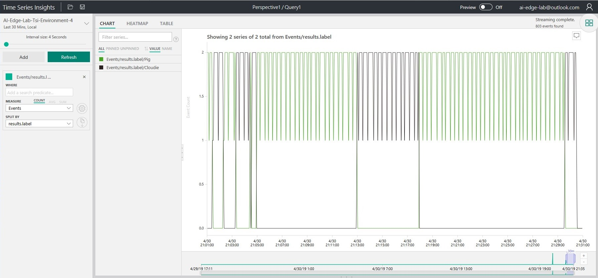

# Hands-On-Lab: Azure IoT Edge + AI on Windows IoT

For this lab, we will use [Azure Cognitive Services](https://azure.microsoft.com/en-us/services/cognitive-services/) - [Custom Vision](https://customvision.ai) to train a machine learning model for image classification. 

We will download the ONNX model from Custom Vision, add some .NET components and deploy the model in a docker container to a device running [Azure IoT Edge](https://azure.microsoft.com/en-us/services/iot-edge/) on [Windows 10 IoT Core](https://www.microsoft.com/en-us/windowsforbusiness/windows-iot).

Images will be captured from a camera on our edge device with inferencing happening at the edge using [Windows ML](https://docs.microsoft.com/en-us/windows/ai/windows-ml/) and sending our results through [Azure IoT Hub](https://azure.microsoft.com/en-us/services/iot-hub/). Finally, we will visualize the results using [Azure Time Series Insights](https://azure.microsoft.com/en-us/services/time-series-insights/).



## Pre-requisites

Before starting this lab, make sure you have the following open:

1. This lab guide
1. Desktop app: [Visual Studio Code](https://code.visualstudio.com)
1. Browser tab: [Custom Vision Service](https://www.customvision.ai/)
1. PowerShell **running as Administrator**

**NOTE: You can find all username and password details in the __credentials.txt__ file in the Desktop > WindowsIoT folder.**

# Step 1 - Train the Model
## 1.1 - Gathering Training data
1. Plug the USB camera into your lab PC
1. Open the Windows Camera app from the Start Menu
1. Take between 10-15 photos of each object you'd like to recognize with your model. **NOTE: More photos with different rotations and focal length should theoretically make for a better model!**
1. Confirm your photos are in the ```Pictures > Camera Roll``` folder

## 1.2 - Creating a Custom Vision Service Project
1. Log into the [Custom Vision Service portal](https://www.customvision.ai/) using the provided Azure credentials (found in the credentials.txt file - see above)
1. Click 'New Project'
1. Enter the following values and click 'Create Project'

|Name                 |Value                |
|---------------------|---------------------|
|Project Name         |[your choice]        |
|Project Types        |Classification       |
|Classification Types |Multiclass           |
|Domains              |General **(compact)**|

## 1.3 - Importing Images into Custom Vision Service
1. Click the 'Add Images' button and browse to the ```Pictures > Camera Roll``` directory
1. Select the 10-15 image set for each a object type
1. Enter a tag name - this is what your model will predict when it sees this object
1. Repeat this until each set of images is uploaded into Custom Vision

## 1.4 - Train and test your model
1. Click the green 'Train' button in the top right corner. After your model has trained, you can see the rated performance
1. Click 'Quick Test' next to the 'Train' button and upload an extra image of your item that **was not** included in the original 10-15 images

## 1.5 - Export ONNX model
1. Return to the Performance tab
1. Click the 'Export' to start the download process
1. Select ONNX as the model format and ONNX 1.2 as the format version
1. Click 'Download' and rename to CustomVision.onnx in the ```Downloads``` folder


# Step 2 - Package the model into a C# .NET Application

## 2.1 - Find the code

1. Open a Windows PowerShell Prompt **as Administrator**
1. Type the following to prepare your environment:
```powershell
cd c:\Users\Admin\Desktop\WindowsIoT\WindowsAiEdgeLabCV
git clean -xdf
git reset --hard
git pull
```

## 2.2 - Prepare your model file
1. Copy your CustomVision.onnx to ```c:\Users\Admin\Desktop\WindowsIoT\WindowsAiEdgeLabCV``` either through Explorer, or with the following command: 

```powershell
copy c:\Users\Admin\Downloads\CustomVision.onnx .\
```

## 2.3 - Build and test the code
1. Run the following code:

```powershell
dotnet restore -r win-x64
dotnet publish -r win-x64
```
2. Point the camera at one of your objects and test by running the following:

```powershell
dotnet run --model=CustomVision.onnx --device=LifeCam
```

If the model is successful, you will see a prediction label show in the console.


# Step 3 - Build and push a container

## 3.1 - Connect to IoT Core device

In this lab, we will build and push the container from the IoT Core device. 

We will need a way to copy files to our device and a Windows PowerShell window from our development PC connected to that device.

First, we will map the Q: drive to our device so we can access files. 

You'll need the Device IP Address. To get the IP Address open the "IoT Dashboard" from the desktop of your surface and select "My Devices".
 
The name of your device is written on the underside of the IoT device case in white ink.

Right click on your device and select "Copy IPv4 Address".

Run the following commands in your PowerShell terminal:

```powershell
$ip = "ENTER YOUR DEVICE IP ADDRESS HERE"
net use q: \\$ip\c$ "p@ssw0rd" /USER:Administrator
```

## 3.2 - Copy binaries to IoT device

We will copy the 'publish' folder over to our device

```powershell
cd "C:\Users\Admin\Desktop\WindowsIoT\WindowsAiEdgeCV"
robocopy .\bin\Debug\netcoreapp2.2\win-x64\publish\ q:\data\modules\customvision
```


## 3.3 - Test the binaries on IoT device

Next we will run the binaries on the target device.

1. Connect the camera to the IoT Core device
1. Establish a remote PowerShell session on the IoT Core device by typing the following in the PowerShell terminal:

**NOTE: This remote PowerShell command requires you to be running your PowerShell terminal as Administrator.**

```powershell
Enter-PSSession -ComputerName $ip -Credential ~\Administrator
cd "C:\data\modules\customvision"
.\WindowsAiEdgeLabCV.exe --model=CustomVision.onnx --device=LifeCam
```

Again, if the test is successful, you should see objects recognized in the console.

## 3.4 - Switch docker to IoT Edge

Azure IoT Edge now uses moby to manage the containers on the IoT Device. We need to run a command to switch to moby.

```powershell
$Env:DOCKER_HOST = "npipe:////./pipe/iotedge_moby_engine"
```

## 3.5 - Containerize the sample app

**NOTE: The 'Container' related credentials (see above) will be useful in these steps.**

```powershell
#SAMPLE: aiedgelabcr.azurecr.io/customvision:1.0-x64-iotcore
$container = "ENTER YOUR CONTAINER NAME HERE"
docker build . -t $container
```

## 3.6 - Authenticate and push to Azure Container Registry

1. Authenticate to the Azure Container Registry

```powershell
docker login "ENTER YOUR CONTAINER REGISTRY NAME/URL" -u "ENTER YOUR CONTAINER REGISTRY USERNAME" -p "ENTER YOUR CONTAINER REGISTRY PASSWORD"

docker push $container
```

# Step 4 - Create an Azure IoT Edge deployment to the target device

## 4.1 - Deploy edge modules to device

Refer to this guide for more information: [Deploy Azure IoT Edge modules from Visual Studio Code](https://docs.microsoft.com/en-us/azure/iot-edge/how-to-deploy-modules-vscode)

1. In Visual Studio Code, open the 'Azure IoT Hub Devices' pane by selecting the Explorer sidebar in the top left corner (Ctrl + Shift + E) and then clicking on the 'Azure IoT Hub Devices' at the bottom of the sidebar when it opens
1. If you see '-> Select IoT Hub', you will need to log in with your Azure Subscription, select the 'MS IoT Labs - Windows IoT' subscription and the IoT Hub
1. Right-click on your device (for example, 'A09') and click 'Create Deployment for Single Device'
1. Select ```C:\Users\Admin\Desktop\WindowsIoT\deployment.json```
1. Look for "deployment succeeded" in the output window.


## 4.2 - Verify the deployment on IoT device

The module deployment is instant, however changes to the device can take around 5-7 minutes to take effect. On the **target device** you can inspect the running modules with the following command in the remote PowerShell terminal:

```powershell
iotedge list
```

Once the modules have deployed to your device, you can inspect that the "customvision" module is operating correctly:

```powershell
iotedge logs customvision
```

## 4.3 - Monitor Device to Cloud messages

1. In Visual Studio Code, open the 'Azure IoT Hub Devices' pane  
1. Right-click your device and 'Start monitoring D2C messages'
1. Test your model by holding up objects in front of the camera


# Step 5: View the results in Time Series Insights

1. Open the [Time Series Insights explorer](https://insights.timeseries.azure.com/) in a browser tab
1. Set 'Quick Times' to 'Last 30 minutes'
1. Click the 'Auto On/Off' button until it reads 'Auto On'
1. Press the search icon to update the data set
1. Set the Interval Size to 4 seconds (lowest possible)
1. In the 'Events' section of the left panel, set 'Measure' to 'Count' of 'Events', and 'Split by' to 'results.label'
1. Press the 'Refresh' button to refresh data

Now you can change the object in front of the camera, and wait 10 seconds or so for the data to propagate, then press 'Refresh' again. 
You'll see the graph change to show telemetry reported when your objects are recognised.



**Thanks for participating in the lab!**
